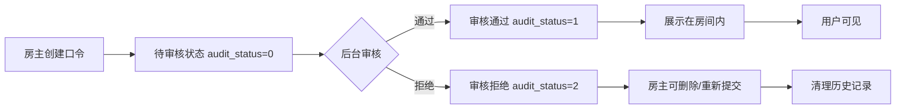

# 大哥房口令功能 - 技术开发文档

> 📋 **文档类型**: 技术开发文档  
> 🎯 **项目**: 大哥房口令功能 (Big Brother Passcode)  
> 📁 **知识库**: 业务知识库 (`slp-harness`)  
> 📍 **路径**: `knowledge/cross-projects/chatroom/passcode-technical-design.md`  
> 👤 **作者**: @Hugh  
> 📅 **创建时间**: 2026-04-16  
> 🔄 **最后更新**: 2026-04-17  
> 📌 **关联需求**: [[../../../passcode-requirement|大哥房口令功能需求]]
> 📌 **需求版本**: v2.0 (全状态展示 + use 接口)

---


- [[#🎯 概述]]
- [[#🏗️ 系统架构]]
- [[#💾 数据库设计]]
- [[#🔧 代码结构设计]]
- [[#📦 Model 层设计]]
- [[#⚙️ Service 层设计]]
- [[#🌐 API 层设计]]
- [[#🔐 权限与校验]]
- [[#⚡ 性能优化]]
- [[#🧪 测试方案]]
- [[#📋 开发任务清单]]
- [[#🔗 参考资料]]

---

## 🎯 概述

### 功能简介

大哥房口令功能允许**大哥房房主**创建个性化资源（图片 + 视频），经后台审核后在房间内展示。

### 核心流程图



### 技术栈

| 组件 | 技术选型 | 说明 |
|------|---------|------|
| **语言** | Go 1.21+ | slp-room 项目 |
| **框架** | Go Frame V1.15.4 | 基于 GF 的 Web 框架 |
| **数据库** | MySQL 5.7 | 表名前缀 `xs_` |
| **ORM** | Go Frame DAO | 自动生成 |
| **缓存** | Redis | 配额信息缓存 |
| **日志** | GF Logs | 结构化日志 |

### 版本说明

**Go Frame V1.15.4 注意事项**:
- 使用 `gdb` 包而非 `g.DB()`（V2 语法）
- DAO 生成使用 `gf gen dao`（V1 命令）
- 事务使用 `db.Transaction()` 而非 `gdb.Transaction()`
- 错误码使用 `gerror.NewCode()` 配合 `gcode.Code`

**MySQL 5.7 注意事项**:
- 不支持窗口函数（ROW_NUMBER 等）
- 不支持 CTE（WITH 子句）
- 支持基础复合索引
- JSON 字段支持有限（使用 VARCHAR 替代）

### 开发原则

遵循 **SLP 业务开发规范** ([[../../../patterns/business-module-standard|business-module-standard.md]]):

1. **Service 层全局单例** - `BigBrotherPasscodeSrv` 作为唯一对外接口
2. **常量分类管理** - 业务专属常量在 `consts/big_brother.go`
3. **事务 + 行锁** - 关键操作使用 `db.Transaction()` + `LockUpdate()`
4. **先校验再操作** - 所有写操作前进行完整校验

---

## 🏗️ 系统架构

### 分层架构

```
┌─────────────────────────────────────┐
│          API Layer (Controller)     │  ← HTTP 接口
├─────────────────────────────────────┤
│          Service Layer              │  ← 业务逻辑
├─────────────────────────────────────┤
│          DAO Layer                  │  ← 数据访问
├─────────────────────────────────────┤
│          Database (MySQL)           │  ← 持久化
└─────────────────────────────────────┘
```

### 模块依赖

```
big_brother_passcode/
├── dao/           # 数据访问层
├── service/       # 业务逻辑层
├── controller/    # API 接口层
├── config/        # 配置管理
└── def/           # 常量定义
```

---

## 💾 数据库设计

### 表结构

**DDL 语句 (MySQL 5.7)**:

```sql
-- 大哥房口令表
-- 版本：MySQL 5.7
-- 创建时间：2026-04-16

CREATE TABLE IF NOT EXISTS `xs_big_brother_passcode` (
  `id` BIGINT(20) UNSIGNED NOT NULL AUTO_INCREMENT COMMENT '口令 ID（主键）',
  `room_id` BIGINT(20) UNSIGNED NOT NULL COMMENT '大哥房 ID',
  `owner_uid` BIGINT(20) UNSIGNED NOT NULL COMMENT '房主用户 ID',
  `name` VARCHAR(100) NOT NULL COMMENT '口令名称',
  `description` VARCHAR(500) DEFAULT NULL COMMENT '口令描述',
  `image` VARCHAR(512) DEFAULT NULL COMMENT '图片资源 URL/ID',
  `video` VARCHAR(512) DEFAULT NULL COMMENT '视频资源 URL/ID',
  `audit_status` TINYINT(4) NOT NULL DEFAULT 0 COMMENT '审核状态：0-待审核，1-通过，2-拒绝',
  `audit_reason` VARCHAR(255) DEFAULT NULL COMMENT '审核拒绝原因',
  `auditor_uid` BIGINT(20) UNSIGNED DEFAULT NULL COMMENT '审核人 ID',
  `audited_at` DATETIME DEFAULT NULL COMMENT '审核时间',
  `create_time` DATETIME NOT NULL DEFAULT CURRENT_TIMESTAMP COMMENT '创建时间',
  `update_time` DATETIME NOT NULL DEFAULT CURRENT_TIMESTAMP ON UPDATE CURRENT_TIMESTAMP COMMENT '更新时间',
  
  PRIMARY KEY (`id`),
  KEY `idx_room_id` (`room_id`) COMMENT '房间 ID 索引',
  KEY `idx_owner_uid` (`owner_uid`) COMMENT '房主 ID 索引',
  KEY `idx_audit_status` (`audit_status`) COMMENT '审核状态索引',
  KEY `idx_create_time` (`create_time`) COMMENT '创建时间索引'
) ENGINE=InnoDB DEFAULT CHARSET=utf8mb4 COMMENT='大哥房口令表';
```

**MySQL 5.7 兼容性说明**:
- ✅ 使用 `DATETIME` 类型
- ✅ 时间字段命名：`create_time` / `update_time`（符合 SLP 规范）
- ✅ 使用 `VARCHAR(512)` 存储 URL（兼容长链接）
- ✅ 使用 `TINYINT(4)` 存储状态枚举
- ✅ 审核字段：`audit_reason`、`auditor_uid`、`audited_at`（v2.0 新增）

**字段说明**:
- `audit_status`: 审核状态（0=待审核，1=通过，2=拒绝）
- `audit_reason`: 审核拒绝原因（v2.0 新增）
- `auditor_uid`: 审核人 ID（v2.0 新增）
- `audited_at`: 审核时间（v2.0 新增）

### 索引设计

| 索引名 | 字段 | 类型 | 作用 | 查询场景 |
|--------|------|------|------|----------|
| `PRIMARY` | `id` | 主键 | 唯一标识 | 根据 ID 查询/更新 |
| `idx_room_id` | `room_id` | 普通索引 | 房间维度查询 | 查房间下所有口令 |
| `idx_owner_uid` | `owner_uid` | 普通索引 | 房主维度查询 | 查房主所有口令（全状态）|
| `idx_audit_status` | `audit_status` | 普通索引 | 审核状态查询 | 审核后台按状态筛选 |
| `idx_create_time` | `create_time` | 普通索引 | 时间排序 | 按创建时间倒序展示 |

**索引说明**:
- v2.0 新增全状态展示逻辑，需要以下索引支持：
  - `idx_owner_uid`: 房主查询自己所有口令（待审核/已通过/已拒绝）
  - `idx_audit_status`: 审核后台查询待审核/已通过/已拒绝列表
  - `idx_create_time`: 按创建时间倒序排序
  - `idx_room_id`: 保持原有，按房间查询口令列表

---

## 🔧 代码结构设计

### 文件组织

```
slp-room/
├── app/
│   ├── dao/                    # 自动生成的 DAO 层
│   │   └── xs_big_brother_passcode.go
│   ├── service/
│   │   └── big_brother/
│   │       ├── passcode.go     # 口令核心业务逻辑
│   │       ├── passcode_create.go
│   │       ├── passcode_audit.go
│   │       ├── passcode_list.go
│   │       ├── passcode_delete.go
│   │       └── config.go       # 等级配置
│   ├── controller/
│   │   └── big_brother/
│   │       ├── passcode.go     # 接口入口
│   │       └── passcode_req.go # 请求参数定义
│   └── def/
│       └── error_code.go       # 错误码定义
└── plugin/
    └── big_brother/            # 大哥房插件目录
        └── passcode/
            └── ...
```

---

## 🛠️ 代码生成

### 1. 数据库 DAO 生成

**使用 slpctl 工具生成**：

```bash
cd slp-room
slpctl gen -t xs_big_brother_passcode
```

**生成文件**：
- `proto/entity_xs_big_brother_passcode.proto` - Proto 定义
- `app/pb/entity_xs_big_brother_passcode.pb.go` - PB 实体（注入 tag）
- `app/dao/internal/xs_big_brother_passcode_dao.go` - 内部 DAO
- `app/dao/XsBigBrotherPasscode.go` - DAO 操作

### 2. API Swag 注释生成

**使用 slpctl swagger 工具**：

```bash
cd slp-room
slpctl swagger -wk . -projects slp-room -out ./docs/swagger
```

**生成api的命令 **：

```go
slpctl code -api /go/room/bigbrother/create
```

---

## 📋 业务逻辑伪代码

### 创建口令流程

```
POST /api/v1/bigbrother/passcode
├─ 1. 校验登录态
├─ 2. 校验房间是否为大哥哥房
├─ 3. 校验权限（必须是房主）
├─ 4. 查询配额（根据大哥房等级）
├─ 5. 检查是否超出配额上限
├─ 6. 开启事务
│   ├─ 插入口令记录（audit_status=0 待审核）
│   └─ 记录操作日志
└─ 7. 返回口令 ID
```

### 审核口令流程

```
POST /api/v1/bigbrother/passcode/audit
├─ 1. 校验登录态
├─ 2. 校验权限（后台管理员）
├─ 3. 查询口令记录（LockUpdate 排他锁）
├─ 4. 检查是否已审核
├─ 5. 开启事务
│   ├─ 更新审核状态
│   ├─ 通过：填充正式资源地址
│   ├─ 拒绝：记录原因
│   └─ 记录审核日志
└─ 6. 返回结果
```

### 查询列表流程

```
GET /api/v1/bigbrother/passcode/list
├─ 1. 校验登录态
├─ 2. 构建查询条件
│   ├─ room_id（必填）
│   ├─ owner_uid（可选，只能查自己的）
│   └─ audit_status（可选）
├─ 3. 权限过滤
│   ├─ 普通用户：只能查 audit_status=1（已通过）
│   ├─ 房主本人：可查自己所有记录（全状态：0/1/2）
│   └─ 后台管理员：无限制，可按任意条件查询
├─ 4. 执行查询（分页）
└─ 5. 返回结果
```

### 使用口令流程（v2.0 新增）

```
POST /api/v1/bigbrother/passcode/use
├─ 1. 校验登录态
├─ 2. 校验口令存在且属于该房间
├─ 3. 校验 audit_status=1（仅审核通过的可用）
├─ 4. 校验当前用户为房主（owner_uid == current_user.uid）
├─ 5. 空实现：仅打印日志，不发放奖励
│   └─ 日志格式：{"module":"big_brother_passcode","action":"use","uid":123,"room_id":456,"passcode_id":789,"audit_status":1,"timestamp":1713254400}
└─ 6. 返回成功
```

---

## 🔐 权限与校验

### 权限矩阵

| 接口 | 登录用户 | 房主 | 后台管理员 |
|------|---------|------|-----------|
| 创建口令 | ❌ | ✅ | ❌ |
| 查询列表（已通过） | ✅ | ✅ | ✅ |
| 查询列表（全状态） | ❌ | ✅ | ✅ |
| 审核口令 | ❌ | ❌ | ✅ |
| 删除口令（待审核/拒绝） | ❌ | ✅ | ✅ |
| 删除口令（已通过） | ❌ | ❌ | ❌ |
| 配额查询 | ✅ | ✅ | ✅ |
| 使用口令 | ❌ | ✅ | ❌ |

---

## 🌐 API 接口设计（v2.0 完整版）

### 1. 创建口令

**接口**: `POST /go/room/slp/big-brother/passcode/create`

**权限**: 登录用户，且为房间 owner

**请求参数**:
| 字段 | 类型 | 必填 | 说明 |
|------|------|------|------|
| room_id | int64 | 是 | 大哥房 ID |
| name | string | 是 | 口令名称（1-100 字符） |
| description | string | 否 | 口令描述（0-500 字符） |
| image | string | 是 | 图片资源（临时/占位） |
| video | string | 是 | 视频资源（临时/占位） |

**返回**:
```json
{
  "code": 0,
  "msg": "success",
  "data": {
    "id": 123,
    "audit_status": 0,
    "create_time": 1713254400
  }
}
```

### 2. 口令列表查询

**接口**: `GET /go/room/slp/big-brother/passcode/list`

**权限**: 登录用户

**请求参数**:
| 字段 | 类型 | 必填 | 说明 |
|------|------|------|------|
| room_id | int64 | 是 | 大哥房 ID |
| owner_uid | int64 | 否 | 房主 UID（不传则查 room_id 对应的房主） |
| audit_status | int | 否 | 审核状态（不传则默认查询已通过的） |

**行为逻辑**:
- 普通用户：仅能查询 `audit_status=1` 的记录
- 房主本人：可查询自己所有记录（全状态：0/1/2）
- 后台管理员：无限制

### 3. 审核口令（后台接口）

**接口**: `POST /go/room/slp/big-brother/passcode/audit`

**权限**: 后台管理员

**请求参数**:
| 字段 | 类型 | 必填 | 说明 |
|------|------|------|------|
| id | int64 | 是 | 口令 ID |
| audit_status | int | 是 | 审核状态（1-通过，2-拒绝） |
| image | string | 否 | 正式图片资源地址（审核通过时必填） |
| video | string | 否 | 正式视频资源地址（审核通过时必填） |
| audit_reason | string | 否 | 拒绝原因 |

### 4. 删除口令

**接口**: `POST /go/room/slp/big-brother/passcode/delete`

**权限**: 登录用户，且为口令 owner

**请求参数**:
| 字段 | 类型 | 必填 | 说明 |
|------|------|------|------|
| id | int64 | 是 | 口令 ID |

### 5. 获取房主等级和口令配额

**接口**: `GET /go/room/slp/big-brother/passcode/quota`

**权限**: 登录用户

**请求参数**:
| 字段 | 类型 | 必填 | 说明 |
|------|------|------|------|
| room_id | int64 | 是 | 大哥房 ID |

### 6. 使用口令（v2.0 新增）

**接口**: `POST /go/room/slp/big-brother/passcode/use`

**权限**: 登录用户

**请求参数**:
| 字段 | 类型 | 必填 | 说明 |
|------|------|------|------|
| id | int64 | 是 | 口令 ID |
| room_id | int64 | 是 | 大哥房 ID |

**行为逻辑**:
1. 验证口令存在且属于该房间
2. 验证 `audit_status=1`（仅审核通过的口令可用）
3. 验证当前用户为房主（`owner_uid == current_user.uid`）
4. **空实现**：仅打印日志，不发放奖励，不做实际业务逻辑

**日志格式**:
```json
{
  "module": "big_brother_passcode",
  "action": "use",
  "uid": 123,
  "room_id": 456,
  "passcode_id": 789,
  "audit_status": 1,
  "timestamp": 1713254400
}
```

**返回**:
```json
{
  "code": 0,
  "msg": "success"
}
```

---

## 🔐 权限与校验

### 权限矩阵

**通用校验伪代码**：

```
校验权限 (ctx, roomID, ownerUID):
├─ 1. 校验登录态 (uid > 0)
├─ 2. 校验房主权限 (uid == ownerUID || isAdmin(uid))
├─ 3. 校验房间类型 (room.Type == BIG_BROTHER)
└─ 4. 返回结果
```

### 错误码定义（v2.0）

```go
// app/def/error_code.go
const (
    // 大哥房口令错误码 (10000-10099)
    ERR_PASSCODE_LIMIT_EXCEEDED   = 10001  // 口令数量已达上限
    ERR_PASSCODE_NOT_FOUND        = 10002  // 口令不存在
    ERR_PASSCODE_NOT_OWNER        = 10003  // 无权限操作（非房主）
    ERR_PASSCODE_AUDIT_FAILED     = 10004  // 审核失败
    ERR_PASSCODE_ALREADY_AUDITED  = 10005  // 口令已审核
    ERR_PASSCODE_INVALID_STATUS   = 10006  // 无效的审核状态
    ERR_PASSCODE_ROOM_NOT_BROTHER = 10007  // 房间不是大哥房
    ERR_PASSCODE_CANNOT_DELETE    = 10008  // 无法删除已通过审核的口令
)
```

---

## ⚡ 性能优化

### 索引优化

数据库索引（见数据库设计章节）：
- `(owner_uid, audit_status)` - 查询用户口令列表
- `(room_id, audit_status)` - 查询房间口令列表
- `(audit_status, audited_at)` - 审核任务队列

### 并发控制

```
创建口令并发场景:
├─ 使用数据库事务保证原子性
├─ 配额校验在事务内执行
└─ 唯一索引防止重复提交
```

---

## 📋 开发任务清单

### 阶段一：数据库层

- [ ] 执行 DDL 创建 `xs_big_brother_passcode` 表
- [ ] 生成 DAO 层代码

### 阶段二：API 层

- [ ] 生成 Service + Handler + Proto 代码
- [ ] 实现业务逻辑

### 阶段三：验证部署

- [ ] 生成 Proto 代码
- [ ] 注册路由
- [ ] 生成 API 文档
- [ ] 测试验证
- [ ] 部署上线

> 具体命令参考 [[slpctl 使用指南]]

---

## 🔗 参考资料

- [SLP 业务开发规范](../../../patterns/business-module-standard.md)
- [业务代码示例](../../../patterns/business-code-example.md)
- [大哥房宠物功能](./pet-feature.md)
- [房间类型开发模板](../../../patterns/room-type-development-template.md)

---

## 📚 变更历史

| 版本 | 日期 | 变更内容 | 作者 |
|------|------|---------|------|
| v1.0 | 2026-04-16 | 初始版本，完成技术设计 | @Hugh |
| v2.0 | 2026-04-17 | 新增 use 接口、全状态展示逻辑、审核字段（audit_reason/auditor_uid/audited_at）、索引优化 | @Hugh |

---

*文档最后更新：2026-04-17*
