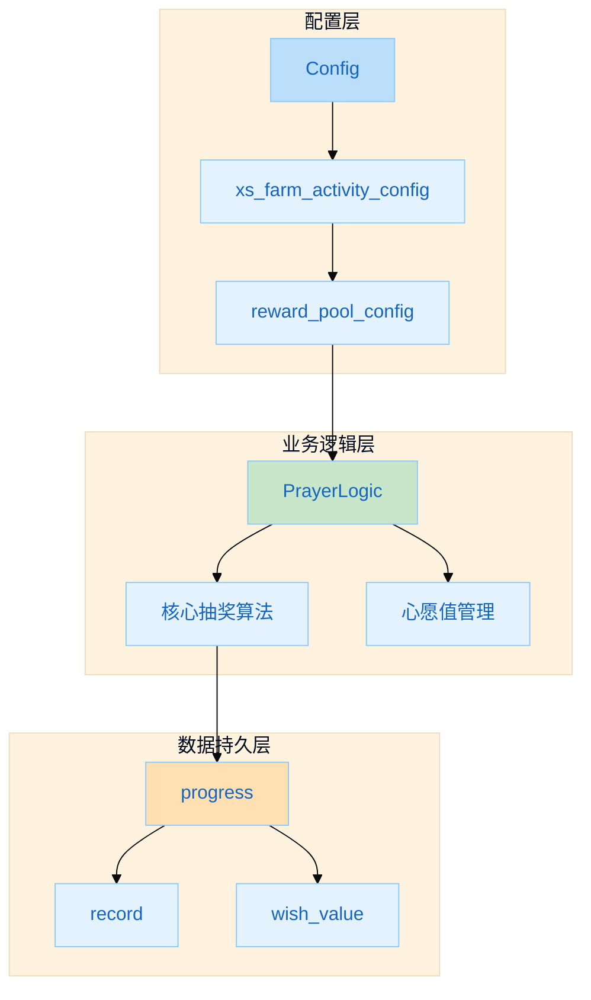
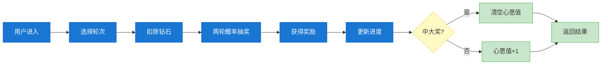
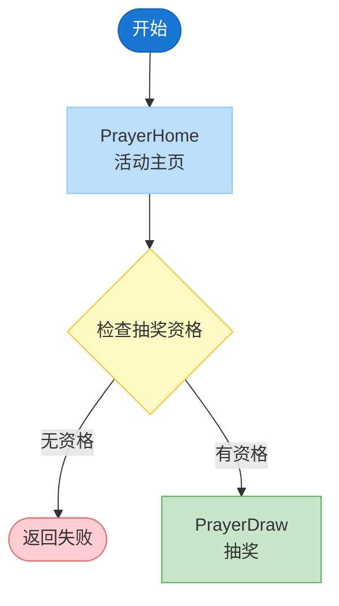
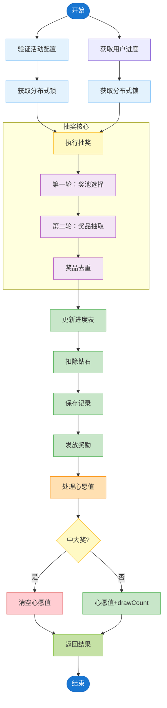
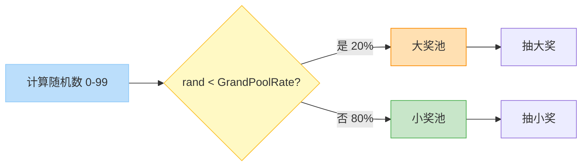
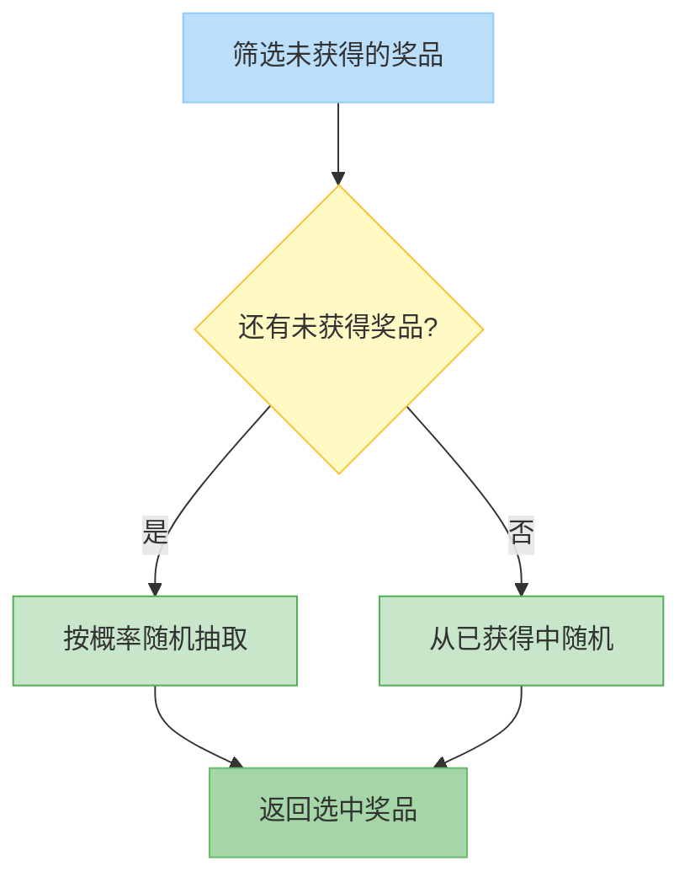

# 祈福抽奖活动（活动模板 2）

> 祈福抽奖活动 - 基于活动模板 2 的概率抽奖玩法  
> **最后更新**: 2026-04-13  
> **PR**: [#294](https://github.com/olaola-chat/slp-starship/pull/294)  
> **版本**: 1.0

---

## 业务全景图

祈福抽奖活动是 slp-starship 的第二款活动模板，基于装饰祈福（模板 1）扩展而来，新增了**两轮概率抽奖**机制和**心愿值系统**。

### 活动架构图



### 核心玩法流程



---

## 项目职责分工

| 项目 | 职责 | 核心模块 |
|------|------|----------|
| **slp-starship** | 活动配置、抽奖逻辑、心愿值管理 | `app/service/farm/prayer.go` |
| **slp-go** | 奖励发放（RPC）、钻石扣除、背包管理 | `rpc/client/starship_farm.go` |

### slp-starship 职责

- 活动配置管理（`xs_farm_activity_config`）
- 奖池配置解析和验证
- 两轮概率抽奖算法实现
- 用户进度管理（`xs_prayer_user_progress`）
- 心愿值管理（`xs_prayer_user_wish_value`）
- 抽奖日志记录（`xs_prayer_user_record`）

### slp-go 职责

- 奖励发放 RPC（`SendFarmCommodity`）
- 钻石扣除 RPC（`SlpCommonConsume`）
- 装扮碎片特殊处理

---

## 核心流程

### 1. 活动主页流程 (`PrayerHome`)



### 2. 祈福抽奖流程 (`PrayerDraw`)



### 3. 两轮概率抽奖算法

**第一轮**（奖池选择）：



**第二轮**（奖品抽取）：



---

## 数据表结构

### 1. xs_farm_activity_config (修改)

```sql
ALTER TABLE xs_farm_activity_config
ADD COLUMN activity_type TINYINT UNSIGNED DEFAULT 0 COMMENT 
  '活动类型：0=模板 1(装饰祈福), 1=模板 2(祈福抽奖)'
AFTER reward_pool_config;
```

### 2. xs_prayer_user_record (新建 - 日志表)

```sql
CREATE TABLE IF NOT EXISTS `xs_prayer_user_record` (
  `id` BIGINT UNSIGNED NOT NULL AUTO_INCREMENT COMMENT '主键 ID',
  `uid` INT UNSIGNED NOT NULL COMMENT '用户 ID',
  `activity_id` INT UNSIGNED NOT NULL COMMENT '活动 ID',
  `round` SMALLINT UNSIGNED NOT NULL COMMENT '第几轮',
  `draw_count` SMALLINT UNSIGNED NOT NULL COMMENT '第几次抽奖',
  `reward_id` BIGINT UNSIGNED NOT NULL COMMENT '获得的奖励 ID',
  `price` INT UNSIGNED NOT NULL COMMENT '消耗的钻石',
  `dateline` INT UNSIGNED NOT NULL COMMENT '抽奖时间戳',
  PRIMARY KEY (`id`),
  KEY `idx_uid_activity` (`uid`, `activity_id`),
  KEY `idx_uid_activity_round` (`uid`, `activity_id`, `round`)
) ENGINE=InnoDB DEFAULT CHARSET=utf8mb4 COMMENT='祈福抽奖用户记录表';
```

### 3. xs_prayer_user_wish_value (新建 - 心愿值表)

```sql
CREATE TABLE IF NOT EXISTS `xs_prayer_user_wish_value` (
  `id` BIGINT UNSIGNED NOT NULL AUTO_INCREMENT COMMENT '主键 ID',
  `uid` INT UNSIGNED NOT NULL COMMENT '用户 ID',
  `activity_id` INT UNSIGNED NOT NULL COMMENT '活动 ID',
  `round` SMALLINT UNSIGNED NOT NULL COMMENT '第几轮',
  `wish_value` INT UNSIGNED NOT NULL DEFAULT 0 COMMENT '心愿值',
  `updated_at` INT UNSIGNED NOT NULL COMMENT '更新时间戳',
  PRIMARY KEY (`id`),
  UNIQUE KEY `idx_uid_activity_round` (`uid`, `activity_id`, `round`)
) ENGINE=InnoDB DEFAULT CHARSET=utf8mb4 COMMENT='祈福抽奖用户心愿值表';
```

### 4. xs_prayer_user_progress (新建 - 主进度表)

```sql
CREATE TABLE IF NOT EXISTS `xs_prayer_user_progress` (
  `id` BIGINT UNSIGNED NOT NULL AUTO_INCREMENT COMMENT '主键 ID',
  `uid` INT UNSIGNED NOT NULL COMMENT '用户 ID',
  `activity_id` INT UNSIGNED NOT NULL COMMENT '活动 ID',
  `round` SMALLINT UNSIGNED NOT NULL COMMENT '当前第几轮',
  `draw_count` SMALLINT UNSIGNED NOT NULL DEFAULT 0 COMMENT '本轮已抽次数',
  `obtained_rewards` JSON DEFAULT NULL COMMENT '已获得奖励 ID 列表 (JSON 数组)',
  `wish_value` INT UNSIGNED NOT NULL DEFAULT 0 COMMENT '当前心愿值',
  `updated_at` INT UNSIGNED NOT NULL COMMENT '更新时间戳',
  PRIMARY KEY (`id`),
  UNIQUE KEY `idx_uid_activity` (`uid`, `activity_id`)
) ENGINE=InnoDB DEFAULT CHARSET=utf8mb4 COMMENT='祈福抽奖用户进度表';
```

---

## 奖池配置结构

### reward_pool_config 字段说明

```json
{
  "multi_draw_config": {
    "enabled": false,
    "draw_count": 10,
    "discount_rate": 90
  },
  "rounds": [
    {
      "round_num": 1,
      "draw_count": 6,
      "prices": [
        {"draw_index": 1, "price": 200, "discount": 0},
        ...
      ]
    },
    ...
  ],
  "pool_config": {
    "grand_pool_rate": 20,
    "normal_pool_rate": 80,
    "grand_pool": {
      "items": [
        {"id": 1001, "probability": 100, "group": 1}
      ]
    },
    "normal_pool": {
      "items": [
        {"id": 2001, "probability": 10},
        ...
      ]
    }
  }
}
```

### 配置验证规则

| 规则 | 说明 |
|------|------|
| Round 数量 = 大奖个数 | 每轮对应一个大奖 |
| 总抽奖次数 = 总奖品数量 | 大奖 + 小奖 = 抽奖次数 |
| 奖池概率总和 = 100% | Grand + Normal = 100 |
| 奖池内奖品概率总和 = 100% | 每个奖池内部概率归一化 |
| RoundNum 唯一 | 不允许重复轮次配置 |

---

## 配置管理

### SQL 配置脚本位置

```
knowledge/cross-projects/prayer-activity/
├── 02-sql-config.md                     # 活动配置 SQL（含奖池、价格）
└── slp-starship.md                      # slp-starship 项目职责
```

### 配置示例

```sql
-- 更新活动配置
UPDATE xs_farm_activity_config 
SET 
    activity_type = 1,
    reward_pool_config = '{...}'  -- JSON 格式奖池配置
WHERE id = 2;

-- 插入抽奖价格配置
INSERT INTO xs_farm_activity_price (activity_id, round, draw_count, price, discount) VALUES
(2, 1, 1, 200, 0),  -- 第1轮，第1次抽，200钻
...
```

---

## 相关文档

| 文档 | 说明 |
|------|------|
| [`02-sql-config.md`](./02-sql-config.md) | 完整的活动配置 SQL（含4轮配置、奖池、价格） |
| [`slp-starship.md`](./slp-starship.md) | slp-starship 项目职责和实现细节 |

---

## 核心代码位置

### slp-starship

| 文件 | 用途 |
|------|------|
| `app/service/farm/prayer.go` | 核心抽奖逻辑 |
| `app/service/farm/prayer_test.go` | 单元测试 |
| `app/api/farm.go` | API 接口 |
| `app/dao/xs_prayer_user_*.go` | DAO 层 |
| `proto/entity_xs_prayer_user_*.proto` | Proto 定义 |

### slp-go

| 文件 | 用途 |
|------|------|
| `rpc/client/starship_farm.go` | SendFarmCommodity RPC |
| `rpc/client/money_consume.go` | SlpCommonConsume RPC |

---

## 问题排查

### 1. 抽奖进度异常

**现象**：用户进度与实际不符

**排查步骤**：
1. 检查 `xs_prayer_user_progress` 表中用户记录
2. 检查 `xs_prayer_user_record` 日志表
3. 检查 Redis 分布式锁是否正常

### 2. 奖励未发放

**现象**：抽取成功但用户背包无奖励

**排查步骤**：
1. 检查 `xs_prayer_user_record` 是否有记录
2. 检查 `slp_common_consume` 表钻石扣除记录
3. 查看 `sendFarmCommodity` RPC 调用日志

---

## API 接口

| 接口 | 路由 | 说明 |
|------|------|------|
| PrayerHome | `/go/slp/farm/prayerHome` | 活动主页 |
| PrayerDraw | `/go/slp/farm/prayerDraw` | 祈福抽奖 |
| PrayerRecord | `/go/slp/farm/prayerRecord` | 抽奖记录 |

---

## 版本信息

- v1.0 (2026-04-13)：初版，基于 PR #294
