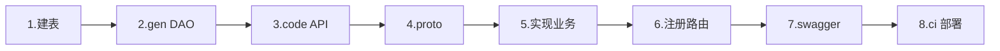

# slpctl 开发工作流指南

> 如何在实际开发中使用 slpctl 完成完整流程

**完整命令参考**: [[slpctl]] | **安装**: `go install github.com/olaola-chat/slpctl@master`

---

## 标准开发流程（8 步）



### 步骤 1：创建数据库表

执行 DDL 创建表结构（略，见技术方案）。

### 步骤 2：生成 DAO 层

```bash
cd slp-room
slpctl gen -t xs_big_brother_passcode
```

**生成内容**：`proto/entity_*.proto` + `app/pb/*.pb.go` + `app/dao/*`

> **⚠️ 禁止手动编辑 DAO/Model** — 所有 `app/dao/internal/*.go`、`app/pb/entity_*.pb.go`、`proto/entity_*.proto` 必须通过 `slpctl gen` 生成。数据库表结构变更后，用 `slpctl gen -t <表名>` 重新覆盖即可。

### slpctl gen 参数详解

| 参数 | 说明 | 默认值 |
|------|------|--------|
| `-t` | 数据库表名，多个表用逗号分隔（必须） | - |
| `-d` | 数据库名 | `xianshi` |
| `-u` | 数据库用户名 | `root` |
| `-p` | 数据库密码 | `root` |
| `-H` | 数据库主机 | `114.55.3.96` |
| `-P` | 数据库端口 | `8547` |
| `-project` | 目标项目目录 | 当前目录 |
| `-delete` | 删除模式：删除指定表生成的代码 | - |
| `-dry-run` | 预览模式：只显示会生成/删除哪些文件 | - |

数据库映射：`xianshi` → `-g default` | `statics` → `-g banban` | 其他 → 自身

示例：
```bash
# starship 项目指定数据库
slpctl gen -t xs_farm_fish_pond_bait -d starship -project /path/to/slp-starship
```

### 步骤 3：生成 API 层

**快速生成（单个 API）**：
```bash
slpctl code -api /go/room/bigBrother/passcodeCreate -desc "创建口令"
```

**批量生成（推荐）**：
```bash
# 创建配置文件
cat > passcode_apis.json << 'EOF'
[
  {"router_path": "/go/room/bigBrother/passcodeCreate", "description": "创建口令"},
  {"router_path": "/go/room/bigBrother/passcodeList", "description": "口令列表"},
  {"router_path": "/go/room/bigBrother/passcodeAudit", "description": "审核口令"}
]
EOF

slpctl code -config passcode_apis.json
```

**生成内容**：`proto/api/*.proto` + `api/handler/*_api.go` + `rpc/server/internal/*_pretend.go`

### 步骤 4：编译 Proto

```bash
# 项目 Makefile 命令
make proto          # 所有修改过的
make proto-all      # 全部重新生成
```

### 步骤 5-6：实现业务 + 注册路由

填充 Service 代码，在 `router/*.go` 注册路由。

### 步骤 7：生成 API 文档

```bash
slpctl swagger -projects slp-room -out ~/.slp/swagger
```

### 步骤 8：部署测试

```bash
git checkout dev && git merge <feature> && git push origin dev
slpctl ci -w
```

---

## 路由命名规范

> 详细说明见 [[slpctl#路由规则]]

```
/go/room/bigBrother/passcodeCreate
  ↑      ↑          ↑
 项目   业务模块    具体 API（首字母小写驼峰）
```

**项目前缀**：slp-go → `/go/slp/` | slp-room → `/go/room/` | slp-starship → `/go/starship/`

---

## 分支管理

```bash
# 创建功能分支
git checkout -b hu/<feature_name>

# 合入 dev（推荐 --no-ff 保留历史）
git checkout dev
git merge --no-ff hu/<feature_name>
git push origin dev

# 清理分支
git branch -d hu/<feature_name>
```

---

## 相关文档

- [[slpctl]] - 完整命令参数参考
- [[slp-business-development-standard]] - 业务模块开发规范
- [[dev-to-dev-deployment]] - 开发机部署
